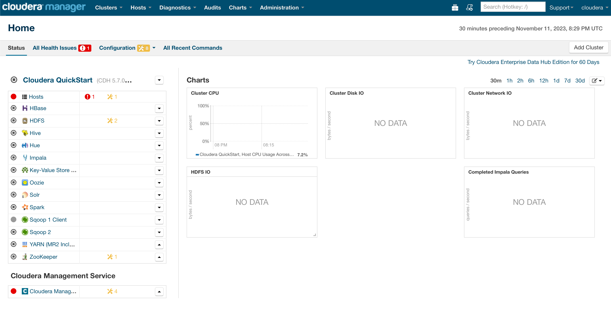

# Виконання tutorial

# Запит на власному датасеті

[Посилання на датасет](https://data-lakecountyil.opendata.arcgis.com/datasets/lakecountyil::national-obesity-by-state/about)

Запит на штат з найвищим obesity:
> select NAME, obesity.Obesity from obesity join (select max(obesity.Obesity) as max_obesity from obesity) t on t.max_obesity = obesity.Obesity;

Результат:
> Louisiana	36.2

# Запуск образ docker від Cloudera

Користувався [цим tutorial](https://blog.clairvoyantsoft.com/cloduera-quickstart-vm-using-docker-on-mac-2308acd196f2)

